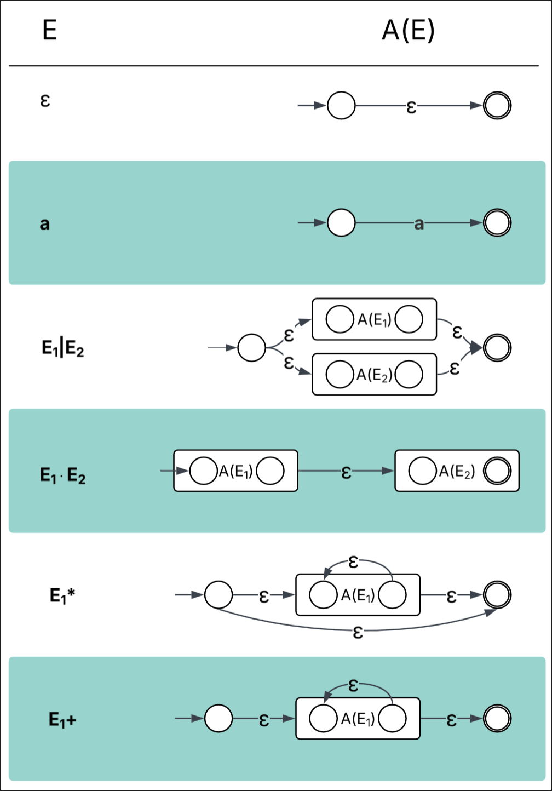

# Task X: Regex to $\epsilon$-NFA

The detailed rules of the mandatory assignment are found [here](README.md).

NOTE: ensure that the master branch of your repository is updated with:

- MacOS, Linux: `./update.sh`
- Windows: `update.ps1`

## Goals

The goal of this task is to apply your knowledge about Thompson Constructions to convert regex strings into $\epsilon$-NFA's.

## Detailed Description

> **Relevant files in your group's repository:**
>
> RegexAST.fs; RegexToENFA.fs

Your task is to implement the function:

```
let analysis (input: Input) : Output =
    let lexbuf = LexBuffer<char>.FromString input.regex
    let ast = RegexGrammar.regex RegexLexer.tokenize lexbuf
    failwith "Module not yet implemented"
```

The above program takes a [RegEx string](regex.md) and produces a $\epsilon$-NFA using Thompson Constructions in the [dot-language](dot.md).

For the transitions you can use the following epsilon: `ε` or `ϵ`

**Below are the exact Thompson Constructions you need to implement. Alternative language-equivalent productions are not accepted**



Launch inspectify as usual:

```
# On Windows
inspectify.ps1 --open
# On macOS and Linux
./inspectify.sh --open
```

## Hints

- File `RegexAST.fs` contains the definition of type `regex`, which you should follow to identify the cases neded in the pattern maching.

## Feedback & Evaluation

You can evaluate your solution by comparing the result to the ones provided by the `inspectify` tools.

We encourage you to proactively ask for feedback from the TAs and the teacher.
